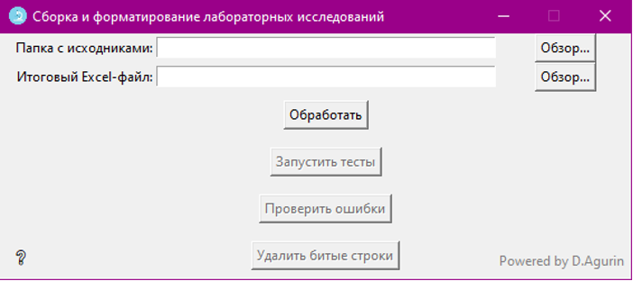
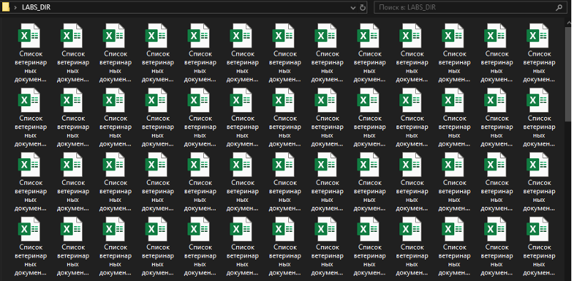
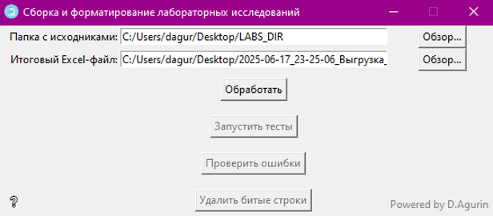
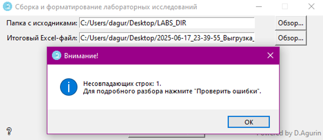
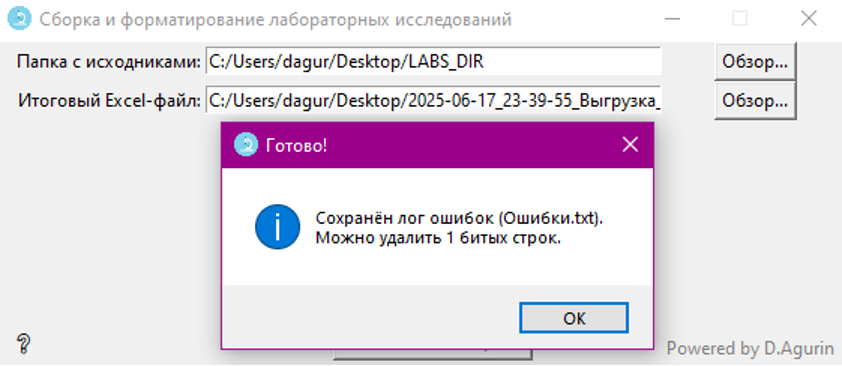
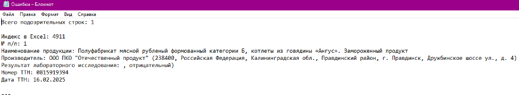

# 🧪 Lab Parser — автоматизация сбора и форматирования лабораторных исследований

> Быстрый взгляд на интерфейс:

  

## 1. О программе
Lab Parser — инструмент для быстрой и надежной автоматизации обработки лабораторных исследований, выгруженных из ГИС “Меркурий”.
- Позволяет собрать, распарсить, проверить и красиво оформить десятки отчетов в единую Excel-таблицу.
- Автоматически ищет и сигнализирует о возможных ошибках в структуре данных.
- В случае выявления "проблемных" строк после тестов, парсер позволяет удалить их в автоматическом режиме.

## 2. Требования
- ОС: Windows 10/11 (x64)*
- Excel: Microsoft Excel 2007+ (обязательно!)
- Программа работает "из коробки" — дополнительные библиотеки не нужны (exe файл самодостаточен)

\* В теории может работать и на более старых версиях ОС и Excel, но стабильность и корректность работы не гарантируется.  
По запросу могу собрать и прислать дистрибутив под Mac/Linux.

## 3. Как подготовить выгрузку
- Выгружайте из Меркурия все обязательные поля:
  - № п/п (встроено изначально)
  - Наименование продукции
  - Производитель
  - Результат лабораторного исследования
  - Номер ТТН
  - Дата ТТН 
- Не меняйте структуру файла руками!
- Каждый столбец должен быть отдельным (не объединять ячейки, не скрывать столбцы).  
Если в дальнейшем потребуется изменить набор столбцов, программа будет пересобрана и выдана повторно.

## 4. Как пользоваться
1) Скопируйте все исходные .xlsx-файлы в отдельную папку (например, LABS_DIR):

  

2) Запустите `Lab_parser.exe`:

  

3) Укажите папку с исходниками и выберите место для сохранения итогового файла через кнопки «Обзор…»:

  

4) Нажмите на кнопку «Обработать».

5) После появления сообщения об успешном сохранении файла рекомендуется прогнать тесты, т.е. нажать на кнопку «Запустить тесты».

6) Если ошибок при обработке найдено не будет, Вы получите соответствующее сообщение:

  

7) В случае обнаружения несоответствий, сообщение будет содержать количество несовпадающих строк между сборкой исходных файлов .xlsx из папки и готовым файлом с выгрузкой, выбранными в п. 3:

  

8) При нажатии на кнопку «Проверить ошибки», лог с найденными «подозрительными» строками `Ошибки.txt` будет сохранен в папку с программой:

  

9) В данном логе Вам будет представлены индексы некорректных строк со всей информацией для анализа и принятия решения о запуске автоматического удаления таких строк:

  

10) После ручной проверки, Вы можете нажать на кнопку «Удалить битые строки», тем самым в появившемся диалоговом окне Вам будет предложено выбрать место для сохранения конечного файла без некорректных строк.

## 5. Настройка формата итоговой таблицы
- Оформление итогового файла наследуется из шаблона `Формат_выгрузки.xlsx` (лежит рядом с программой)
- Хотите поменять стиль? Откройте шаблон, отредактируйте как нужно, сохраните — новый формат будет использоваться автоматически при последующих обработках
- Не меняйте порядок столбцов! Меняйте только шапку, цвета, шрифты, ширину/высоту строк
- Не меняйте название и не удаляйте шаблон!

## 6. Ошибки и FAQ
- Если при тестах найдены ошибки (битые строки, дублирующее "отрицательный") — в папке с программой появится файл `Ошибки.txt`. Проверьте эти строки вручную, либо удалите автоматом.
- В столбце "Номер ТТН" сохраняется формат текст — ведущие нули не пропадут.
- Если файл не открывается или Excel пишет про "повреждение" — проверьте версию Excel (2007+).
- ⚠️ Программа не содержит вредоносного кода, но некоторые антивирусы могут ошибочно блокировать или ругаться на исполняемые файлы, созданные вручную (особенно без цифровой подписи). Если возникает предупреждение — дайте знать автору, либо добавьте программу в список исключений.

## 7. Классические ошибки и их обработка
- Дублирующийся "отрицательный" внутри одного блока — программа распознает и подскажет, в каких строках проблема (подробно в п.11)
- Ошибки всегда можно посмотреть в файле `Ошибки.txt`, который появляется после проверки
- В результате множества тестов, проблем с обработкой сложных случаев заполнения номеров актов (к примеру, нескольких актов через ";" или вложенных скобок внутри одного исследования) не выявлено

## 8. Автор
**Powered by danthecoolest**  
По всем вопросам:

Github: **https://github.com/xdanthecoolest**

Telegram: **@Daniil_Agurin**

## 9. Лицензия
Только для использования в личных и служебных целях.  
(Если используете для других задач — не забудьте указать автора!)

## 10. История изменений
- **v1.0** — первая стабильная версия

## 11. Примеры работы
При занесении результатов ЛИ по данной продукции в ГИС «Меркурий» КП ошибочно задублировал «Результат исследования», прописав «отрицательный» в «Наименование показателя»:

  

Для понимания критичности данных действий, стоит вкратце описать механизм работы парсера:  
После объединения всех исходных файлов, для каждой строки из столбца «Результат лабораторного исследования» идет разбиение на отдельные блоки, содержащие отдельные ЛИ в формате (Лаборатория-Номер/Дата исследования-Показатели/Результат):

**Пример:**
`[ОПВК Данковского филиал АО ЧМПЗ, эксп. № 00000-00000 от 00.00.2025 г. (трихинеллез, отрицательный)', 'ЛИЛ ФГБУ "ВНИИЗЖ", эксп. № 000.00ХХ от 00.00.2025 г. (микробиология: Listeria monocytogenes, БГКП (колиформы), бактерии рода Proteus, КМАФАнМ, патогенные, в т.ч. сальмонеллы, отрицательный)]`

Разбивка происходит по ключевому слову «отрицательный» (т.к. это единственное, что КП вносит не вручную, выбирая этот параметр из выпадающего списка в интерфейсе ГИС «Меркурий»), тем самым минимизируется количество некорректно обработанных строк при работе парсера.  
При разделении строки `КИЛ ФГБУ "ВНИИЗЖ", эксп. № 00.Х0/000ХХ от 00.00.2025 г. ((микробиологические показатели (в т.ч. Listeria monocytogenes), показатели качества, физико-химические показатели, отрицательный), отрицательный)` программа ошибочно принимает первое вхождение «отрицательный» за отдельное исследование, создавая под него лишнюю строку в итоговом файле:

  

## 12. От автора
Цель проекта – ускорить процесс разбиения ЛИ, в автоматическом режиме обрабатывая сложные строки, с которыми встроенный функционал Excel не в силах справиться.  
Я верю, что автоматизация — лучший способ экономить время на скучных задачах, чтобы больше заниматься интересными и полезными делами :)

Спасибо, что используете Lab Parser!  
Если появятся идеи или пожелания, пишите — буду рад доработать и улучшить инструмент.
